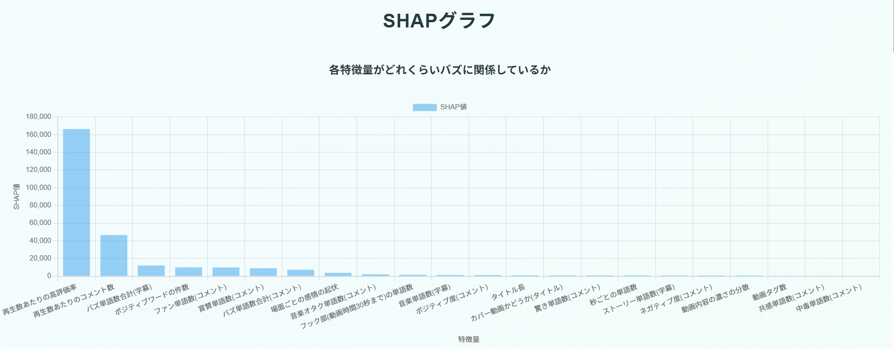
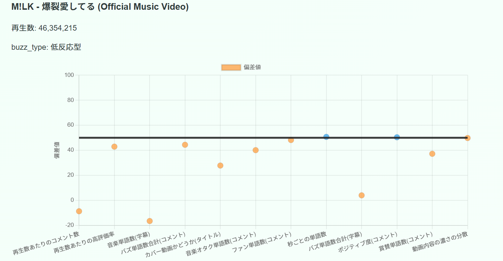
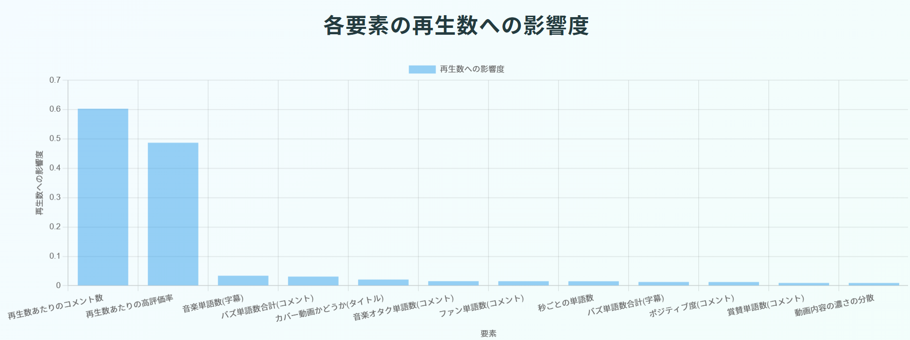
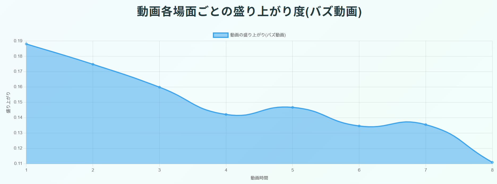
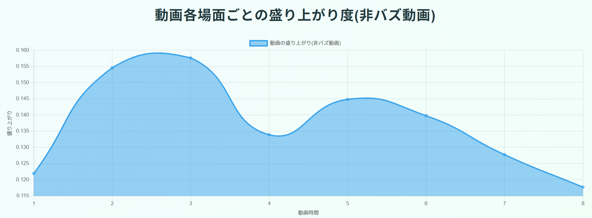
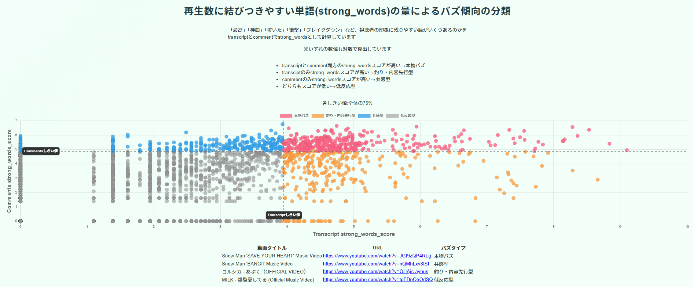
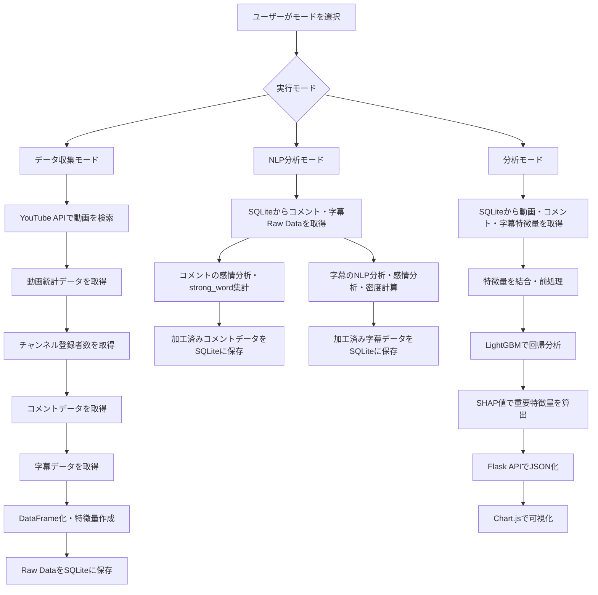
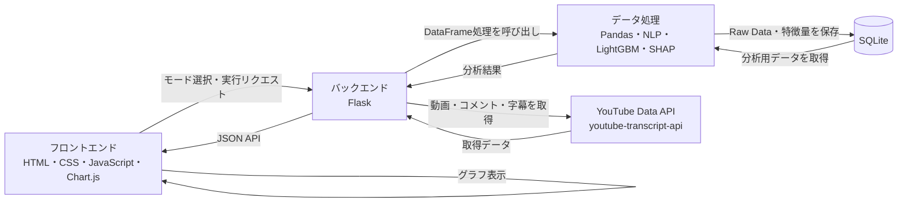

# YouTubeバズ診断くん 仕様書

## 1. プロジェクト概要
YouTubeバズ診断くんは、YouTube動画のタイトル、タグ、コメント、字幕、再生数、高評価数などのデータを取得し、再生数が伸びている動画の特徴を分析・可視化するWebアプリケーションです。

単に再生数やコメント数を表示するだけでなく、自然言語処理、機械学習、SHAP値、グラフ表示を組み合わせることで、「なぜその動画が反応を得たのか」を多角的に確認できることを目的としています。

#### ポートフォリオ名  
YouTubeバズ診断くん

#### 制作者名  
畠中 駿

#### 作成日  
2026年4月-6月

#### GitHubのリンク  
<https://github.com/Shun42/YouTube_Buzz_Shindankun>
---

## 2. ソフトの目的・概要

#### 2.1 このソフトで解決したい課題  
YouTubeの再生回数の増加要因を調査し、バズりやすい動画の特徴を可視化することです。

#### 2.2 どのような人・場面を想定したソフトか  
YouTubeの動画投稿者、Webマーケターなどです。

#### 2.3 何を入力し、何を出力するのか  
YouTubeでは、再生数が伸びる要因が一つだけで決まるとは限りません。 
本アプリは、YouTube動画のデータを分析し、再生数が伸びた動画の特徴を可視化するためのWebアプリケーションです。 
本アプリケーションでは、YouTube Data APIや字幕データを用いて動画に関するデータを取得し、Pandasによる前処理、自然言語処理、機械学習、グラフ表示を通して、再生数増加に関係しそうな特徴を分析します。

#### 2.4 使用技術  
使用言語:Python, JavaScript, HTML, CSS  
自然言語処理:asari, fugashi, jp-stopword-filter, MeCab, vaderSentiment  
API:Flask  
データ取得:Requests, youtube-transcript-api, googleapiclient  
視覚化:matplotlib, Chart.js  
データ処理:Numpy, Pandas, json  
データ分析:spacy, scikit-learn, shap, lightGBM, RandomForest  
データ保存:SQLite  
パッケージ管理:Anaconda  

## 3. 結論：このソフトでできること・成果

#### 3.1 実際にできること  
youtubeのAPIを用いて動画、コメント、字幕(transcript)のデータを取得します。  
各データから動画の構成、コメントや字幕の内容の特徴、動画の基礎データを特徴量として算定します。  
算定した特徴量から動画のバズの原因を特定します。  

#### 3.2 分析結果からわかること  
どのような原因が再生数増加と関連があるのか  
strong_words("神"、"感動"など感情・驚き・音楽的反応を表す再生数との関連が強い言葉)が再生数増加に与えた影響  
動画の構成(動画時間のどこに字幕が多く詰まっているのか)  

#### 3.3 このポートフォリオでアピールしたい結論  
タイトルやコメントに含まれる強い言葉、字幕内の表現、再生数やコメント数などを組み合わせることで、  
単なる再生数の確認ではなく、「なぜ反応が得られたのか」を分析できる点  


---

## 4. 実行結果と結果からわかること

#### 4.1 データ一覧画面

取得した動画データ、再生数、高評価数、コメント数、各種特徴量などを一覧で確認できます。
#### 4.2 特徴量の可視化画面

LightGBMで再生数を目的変数として学習し、SHAP値を用いて、どの特徴量が再生数に影響しているかを可視化しました。  
再生数あたりの高評価率やコメント数に加え、ポジティブワード数、ファンを示す語句の数なども関連しており、動画に対して好意的な反応を持つ視聴者の存在が重要であることが確認できます。  
#### 4.3 一つの動画あたりの分析画面

各動画について、特徴量が全体平均と比べてどの程度大きいかを偏差値として算出しました。  
これにより、特定の動画が「コメントが強い動画なのか」「字幕密度が高い動画なのか」「ポジティブ反応が多い動画なのか」を確認しやすくしています。
#### 4.4 結果から読み取れる傾向

再生数あたりの高評価率、コメント数はもちろんのこと、ポジティブワードの件数、ファン単語数などが関係しており、根強い好感を持っているファンが多いことが再生数が多いことと関係があることが分かります。

動画時間ごとにtranscriptがどれだけ多いのかをグラフにしました。  
バズ動画ではフック部分(導入部分)の密度が高く、一瞬で視聴者の意識を引き付けられるようなどうががバズっていることが見てとれます。

非バズ動画では、盛り上がりの山は二つあるもののフック部分の密度は低い傾向にあります。

コメントと字幕に含まれる再生数に結びつきやすいと思われる単語 `strong_word` の量をもとに、動画を以下の4タイプに分類しました。  
各分類の代表的な動画を実際に確認できるようURLをそれぞれ添付しています。

| 分類 | 字幕 | コメント | 解釈 |
|---|---|---|---|
| 本物バズ | 多い | 多い | 動画内容と視聴者反応の両方が強い |
| 共感型 | 少ない | 多い | 内容よりも視聴者の感情反応が強い |
| 釣り・内容先行型 | 多い | 少ない | 動画内の情報量は多いが、コメント反応は弱い |
| 低反応型 | 少ない | 少ない | 内容・反応ともに弱い |

しきい値は上位25%を基準にしています。  
コメント側は上位の値が固まりやすく、字幕側は比較的幅広く分布している傾向が見られました。

---

## 5. 準備物・インストール手順・実行方法

本アプリケーションを実行するには、Python環境、必要ライブラリ、YouTube Data APIキーの準備が必要です。  
バックエンドはFlask、フロントエンドはHTML / CSS / JavaScriptで構成しています。

### 5.1 使用環境

* OS：Windows
* 言語：Python / JavaScript / HTML / CSS
* Python環境：Anaconda
* Webフレームワーク：Flask
* データベース：SQLite
* グラフ描画：Chart.js
* エディタ：Visual Studio Code

### 5.2 必要なライブラリ

主に以下のライブラリを使用しています。

* Flask
* pandas
* numpy
* scikit-learn
* lightgbm
* shap
* matplotlib
* google-api-python-client
* youtube-transcript-api
* requests
* spacy
* asari
* fugashi
* MeCab / mecab-python3
* jp-stopword-filter
* vaderSentiment
* python-dotenv

詳細なライブラリ一覧は、`requirements.txt` に記載しています。

### 5.3 インストール手順

まず、リポジトリを取得し、プロジェクトフォルダへ移動します。

```bash
cd "C:\Python Projects\YouTube_Buzz_Shindankun"
```

次に、Python環境を作成し、必要なライブラリをインストールします。

```bash
pip install -r requirements.txt
```

仮想環境を作成してからインストールします。  
Pythonのバージョンは3.11を指定します。  
requirements.txtに記載されているライブラリを一括でインストールしてから別途個別にコマンドを打ってspacyの拡張機能を導入します。

```bash
venv create -n YouTube_Buzz_Shindankun python=3.11
venv activate YouTube_Buzz_Shindankun
pip install -r requirements.txt
python -m spacy download en_core_web_sm
```

APIキーなど、事前に準備する情報
本アプリケーションでは、YouTubeの動画情報やコメント情報を取得するために、YouTube Data APIキーが必要です。

backend フォルダ内に `.env` ファイルを作成し、以下のようにAPIキーを設定します。

```env
YOUTUBE_API_KEY=自分のYouTube Data APIキー
```

字幕取得時にプロキシを使用する場合は、必要に応じて以下も設定します。

```env
proxy_username=プロキシのユーザー名
proxy_password=プロキシのパスワード
```

実行コマンド
以下のコマンドでFlaskアプリケーションを起動します。

```bash
python backend\main.py
```

起動後、ブラウザで以下のURLにアクセスします。

```text
http://127.0.0.1:5000/
```

画面から実行モードを選択すると、YouTubeデータの取得、NLP処理、分析結果の表示を行えます。

注意点  
YouTube Data APIキーは、ソースコードに直接書かず、`.env` ファイルで管理します。  
`.env` ファイルはGitHubなどに公開しないようにします。  
YouTube Data APIには利用上限があるため、大量にデータ取得を行う場合はAPI制限に注意が必要です。  
字幕やコメントは、動画によって取得できない場合があります。  
分析結果は取得時点のデータに基づくため、再生数やコメント数は実行タイミングによって変化します。  
`requirements.txt` には開発環境由来のパッケージも含まれているため、別環境でインストールする場合は調整が必要になる可能性があります。

---

## 6. システム構成・処理フロー

本アプリケーションは、主に以下の3つのモードで構成されています。

1. データ収集モード
2. NLP分析モード
3. 分析モード

#### 6.1 データ収集モード
動画データを取得し、さらに動画のコメントデータ、字幕データをそれぞれ取得、加工するモードです。  

* 全体の処理の流れ
1. youtube APIで検索し、動画データを取得するためのconfigを作成する
2. configを元にYouTube Data API(Search: list)で動画の基礎データを取得する
3. YouTube Data API(Videos)で動画の統計データを取得する
4. 得られた統計データを集計する
5. 統計データからその動画が発表されたチャンネルにアクセスし、そのチャンネルの登録者数を取得する
6. それぞれの動画のコメントデータを最大30件取得し、加工する
7. それぞれの動画の字幕データ(transcripts)を取得し、加工する
8. 動画データをPandasのDataFrameに加工する
9. 動画データのうち、タイトルとタグのデータをNLP分析し、特徴量を集計する
10. コメントデータをNLP分析し、特徴量を集計する
11. 動画データ、コメントデータ、字幕データをRaw DataとしてSQLiteに保存する


#### 6.2 NLP分析モード
データ収集モードでSQLiteに保存したコメントデータ、字幕データを取り出し、より詳細な自然言語処理を行うモードです。  
コメントや字幕に含まれる感情、強い反応を表す単語、動画内の言葉の密度などを特徴量として集計します。

* 全体の処理の流れ
1. SQLiteに接続する
2. comment_raw_dataから最新のコメントデータを取得する
3. transcript_raw_dataから最新の字幕データを取得する
4. 字幕データに対して、日本語・英語それぞれのNLP処理を行い、トークン化する
5. 字幕データに対して、ポジティブ・ネガティブなどの感情分析を行う
6. 字幕内の単語数、動画時間ごとの単語密度、フック部分の密度を集計する
7. 字幕内のstrong_wordを集計し、字幕由来の特徴量を作成する
8. コメントデータに対して、感情分析を行う
9. コメント内のstrong_wordをカテゴリごとに集計する
10. 加工後のコメントデータ、字幕データをSQLiteに保存する

#### 6.3 分析モード
データ収集モード、NLP分析モードで作成した特徴量を統合し、再生数に関係する要素を機械学習とグラフで分析するモードです。  
LightGBMによる回帰分析とSHAP値を用いて、どの特徴量が再生数増加に関係しているかを可視化します。

* 全体の処理の流れ
1. SQLiteに接続する
2. 動画データ、コメント特徴量、字幕特徴量をSQLiteから取得する
3. 動画IDをキーにして、動画データ・コメントデータ・字幕データを結合する
4. 機械学習に不要な列を削除し、欠損値や無限大の値を処理する
5. 再生数を目的変数、その他の特徴量を説明変数として設定する
6. データを学習用データとテスト用データに分割する
7. LightGBMで回帰モデルを学習する
8. SHAP値を計算し、再生数に影響した特徴量の重要度を算出する
9. グラフ表示用に、特徴量名を日本語化し、散布図・ワードクラウド・時系列グラフ用のデータを作成する
10. バズ動画と非バズ動画を分け、字幕の時間帯ごとの単語量を集計する
11. コメントと字幕のstrong_wordスコアから、動画を「本物バズ」「共感型」「釣り・内容先行型」「低反応型」に分類する
12. Flask APIを通して、分析結果をフロントエンドに渡す
13. Chart.jsでSHAP値、散布図、時系列グラフ、ワードクラウド、動画比較結果を表示する


#### 6.4 データ取得から可視化までの流れ  
1. ユーザーがWeb画面から実行モードを選択する
2. データ収集モードでYouTube API、コメントAPI、字幕APIからデータを取得する
3. 取得した動画・コメント・字幕データをDataFrame化し、Raw DataとしてSQLiteに保存する
4. NLP分析モードでRaw Dataを取り出し、コメント・字幕の自然言語処理を行う
5. NLP分析で作成した特徴量をSQLiteに保存する
6. 分析モードで動画特徴量、コメント特徴量、字幕特徴量を結合する
7. LightGBMで再生数を予測する回帰モデルを作成する
8. SHAP値で、再生数に影響した特徴量を算出する
9. Flask APIで分析結果をJSON形式に変換する
10. JavaScriptとChart.jsで、分析結果をグラフとして可視化する


#### 6.5 図やフローチャート





---

## 7. 工夫した点

#### 7.1 特徴量設計の工夫

YouTube APIで取得できるデータには限りがあるため、取得できたデータをどのように特徴量として使うかを工夫しました。  
特に、タイトル、タグ、コメント、字幕などのテキストデータをそのまま使うのではなく、以下のような数値特徴量に変換しました。  

- ポジティブワード数
- ネガティブワード数
- ファンを示す単語数
- `strong_word` の出現数
- コメント内の感情スコア
- 字幕内の感情スコア
- 動画時間ごとの字幕密度
- フック部分の字幕密度

これにより、テキストデータを機械学習やグラフ表示に使える形へ変換しました。

#### 7.2 データ処理の工夫

YouTube APIや字幕取得で得られるデータは、JSON形式やリスト形式など、機械学習にそのまま渡しにくい形式でした。  
そのため、取得後できるだけ早い段階でPandasのDataFrameに変換し、欠損値処理、型変換、正規化、結合を行えるようにしました。

また、処理時間が長くなりやすいNLP分析は、データ収集処理とは別のパイプラインに分けました。  
これにより、一度取得したRaw Dataを再利用しながら、コメント分析や字幕分析を繰り返し実行しやすくしています。

#### 7.3 可視化の工夫

分析結果を数値だけで表示すると、利用者が傾向を理解しにくくなります。  
そのため、Chart.jsを用いて、SHAP値、散布図、時系列グラフ、動画ごとの特徴量比較などを表示しました。

また、グラフの凡例やタイトルをわかりやすくし、どの特徴量を見ているのかが伝わるようにしました。  
外れ値の影響が強いグラフでは、必要に応じて外れ値除去を行い、傾向を読み取りやすくしています。

#### 7.4 エラー対策

API通信、JSON生成、SQL接続など、エラーが起こりやすい箇所には例外処理を入れました。

特に、SQLite接続ではfinally節を使い、処理終了時に接続を閉じるようにしています。  
また、フロントエンドから送信される実行モードについても、バックエンド側で想定された値かどうかを確認し、不正な値の場合はエラーとして処理するようにしました。

#### 7.5 セキュリティ面の配慮

YouTube Data APIキーは、ソースコードに直接書かず.envファイルで管理しています。  
GitHubに公開する場合でも、認証情報が漏れないようにするためです。

また、本アプリケーションで扱うデータは、YouTube上で取得可能な公開データに限定しています。  
個人のログイン情報や非公開データは扱わない設計にしています。


---

## 8. 苦労した点・改善した点

#### 8.1 実装中に難しかったこと

実装中に特に難しかった点は、以下の通りです。

- YouTube Data APIの利用制限への対応
- 字幕データ取得の安定性
- JSON形式のデータをPandasのDataFrameに変換する処理
- FlaskからJavaScriptへデータを渡す流れの設計
- テキストデータを機械学習で扱える数値特徴量に変換する処理
- 大量の字幕データを処理する際の処理時間
- 長時間処理中にエラーが出た場合の再実行のしやすさ

特に、大量の字幕データを一度に処理する場面では、処理に長い時間がかかりました。  
一度エラーが出ると、それまでの処理結果が失われる問題があったため、Raw DataをSQLiteに保存し、処理を段階的に分ける設計に改善しました。

#### 8.2 発生したエラー

主に以下のようなエラーが発生しました。

- データ型の不一致によるエラー
- 欠損値や無限大の値による機械学習時のエラー
- API利用上限による `quota exceeded` エラー
- 字幕が存在しない動画での取得エラー
- フロントエンドへ渡すJSON生成時のエラー

#### 8.3 改善した流れ

改善のために、以下のような対応を行いました。

1. YouTube Data APIで取得できるデータと制限を調査した
2. API取得後のデータを早い段階でDataFrameに変換するようにした
3. Raw DataをSQLiteに保存し、後続処理で再利用できるようにした
4. データ収集、NLP分析、機械学習分析を別モードに分けた
5. 欠損値処理、型変換、不要列削除を明確にした
6. Flask APIからJavaScriptへ渡すデータ形式を整理した
7. グラフ表示用のデータをJSON化しやすい形式に変換した

#### 8.4 学習につながった点

この開発を通じて、以下の内容を実践的に学びました。

- PythonでAPIからデータを取得する方法
- JSONデータをPandasで加工する方法
- SQLiteを使ったデータ保存
- 自然言語処理による特徴量作成
- LightGBMによる回帰分析
- SHAP値による特徴量重要度の確認
- Flaskによるバックエンド実装
- JavaScriptとChart.jsによる可視化
- フロントエンドとバックエンドのデータ受け渡し

---

## 9. 応用例・今後の改善点

#### 9.1 対象SNSの拡張

現在はYouTubeを対象にしていますが、今後はTikTok、Instagram、XなどのSNSにも対象を広げたいです。  
投稿文、コメント、いいね数、再生数、共有数などを横断的に取得・分析できるようにすることで、SNS全体の反応傾向を比較できるアプリに発展させられると考えています。

#### 9.2 時系列分析の追加

現在は実行時点のデータを取得して分析しています。  
今後は定期的にデータを取得し、再生数やコメント数の増加推移を時系列で追えるようにしたいです。

これにより、投稿直後に伸びる動画、時間が経ってから伸びる動画など、バズの発生タイミングも分析できるようになります。

#### 9.3 他ジャンルへの対応

現在は音楽動画を主な対象として、タイトル、タグ、コメント、字幕に含まれる特徴から再生数が伸びる要因を分析しています。  
今後は、ゲーム実況、料理、教育、商品紹介、ショート動画など、他ジャンルにも対応させたいです。

ジャンルによって、再生数に影響する要素は異なると考えられます。  
そのため、ジャンルごとに `strong_word` 辞書や特徴量を調整し、それぞれのジャンルに合った分析ができるように改善したいです。

#### 9.4 分析手法の拡張

今回はLightGBMとSHAP値を用いて、再生数に影響している特徴量を分析しました。  
今後は、以下のような分析手法も組み合わせたいです。

- 相関分析
- クラスタリング
- 時系列分析
- ジャンル別比較
- チャンネル別比較
- 投稿時期別比較

これにより、より多角的に動画の特徴を分析できるようになります。

---

## 10. ライセンス

### 10.1 ソースコードについて

本リポジトリ内の自作ソースコードは、MIT License のもとで公開しています。
詳細は、リポジトリ直下の `LICENSE` ファイルを参照してください。

### 10.2 Python依存ライブラリについて

本プロジェクトでは、Flask、pandas、scikit-learn などのPythonライブラリを使用しています。
使用しているPython依存ライブラリのライセンス一覧は、`PYTHON_LICENSES.md` にまとめています。

### 10.3 JavaScriptライブラリについて

本プロジェクトでは、グラフ描画のために Chart.js をCDN経由で読み込んで使用しています。

| ライブラリ    | 用途    | ライセンス       |
| -------- | ----- | ----------- |
| Chart.js | グラフ描画 | MIT License |

本プロジェクトでは、npmパッケージは使用していません。

### 10.4 AI支援による開発について

本プロジェクトのソースコードの一部は、ChatGPTおよびCodexの支援を受けて作成・改善しています。
最終的な実装内容は、リポジトリ所有者が確認・編集しています。

### 10.5 YouTube Data APIについて

本プロジェクトでは、動画情報の取得に YouTube Data API を使用しています。
APIキーなどの認証情報は環境変数で管理しており、本リポジトリには含めていません。

また、本リポジトリにはYouTube動画ファイルそのものや、著作権のある音源・映像データは含めていません。

### 10.6 素材・外部データについて

本リポジトリには、第三者が著作権を持つ画像、音源、動画ファイル、APIキーなどの認証情報は含めていません。

分析に使用するデータについては、外部サービスの利用規約を確認したうえで、ポートフォリオ用途の範囲で使用しています。

### 10.7 注意事項

本プロジェクトは、学習およびポートフォリオ提示を目的として作成したものです。
外部ライブラリ、API、CDN等を利用している箇所については、それぞれのライセンスおよび利用規約に従います。


---

## 11. まとめ

#### 11.1 このポートフォリオで示したい強み
本ポートフォリオでは、YouTube Data APIを用いたデータ取得から、Pandasによるデータ加工、自然言語処理、機械学習、FlaskによるWebアプリ化、Chart.jsによる可視化までを一連の流れとして実装しました。

単に動画の統計データを取得して表示するだけでなく、タイトル、タグ、コメント、字幕などのテキストデータから特徴量を作成し、「なぜ再生数が伸びたのか」を分析できる形にした点を強みとしています。

特に、以下の力を示せる内容になっています。

- APIを使って外部データを取得する力
- 取得したJSONデータを加工・保存する力
- テキストデータを自然言語処理で特徴量化する力
- 機械学習を使って特徴量と再生数の関係を分析する力
- SHAP値を使って分析結果を説明する力
- FlaskとJavaScriptを使ってWebアプリとして表示する力
- 利用者が理解しやすい形でグラフ化する力

#### 11.2 技術面でできるようになったこと
Pythonを用いてAPIからデータを取得し、取得したJSONデータをPandasのDataFrameに変換して加工できるようになりました。  
また、SQLiteへの保存、自然言語処理による特徴量作成、LightGBMによる回帰分析、SHAP値による特徴量重要度の算出など、データ分析に必要な一連の処理を経験しました。

さらに、Flaskでバックエンドを作成し、JavaScriptとChart.jsを用いて分析結果を画面に表示することで、分析処理をWebアプリケーションとして利用できる形にまとめることができました。

Pythonの強みであるデータ処理、機械学習と、JavaScriptの強みであるWebアプリの構築を学び、ある程度引き出せるようになりました。

#### 11.3 就職後にどう活かせるか
本ポートフォリオで学んだ、データ取得、加工、保存、分析、可視化の流れは、実務のデータ分析業務や社内ツール開発にも応用できると考えています。

例えば、以下のような業務に活かせます。

- 売上データの集計・可視化
- 顧客アンケートの自由記述分析
- SNS投稿や口コミの反応分析
- ログデータの整理と傾向分析
- 社内データを扱う簡易ダッシュボード作成
- 業務データの前処理とレポート化

分析結果をただ数値として出すだけでなく、利用者が判断しやすい画面やグラフとして提供する力も活かしていきたいです。

#### 11.4 最後の結論
このアプリケーションを通して、データを集めるだけでなく、加工し、分析し、ユーザーが理解しやすい形で可視化するまでの流れを実装しました。

YouTubeの再生数の増加という複合的な要因の組み合わせに対して、多角的な視点から建築的な要素を組み合わせ、分析していくことができました。

またこのテーマを通じて、Pythonによるデータ処理、自然言語処理、機械学習、Webアプリ開発を組み合わせた課題解決に取り組めたことが、本ポートフォリオの成果です。

